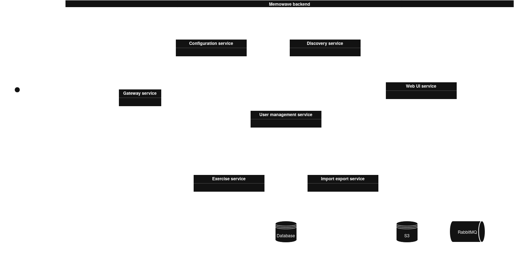
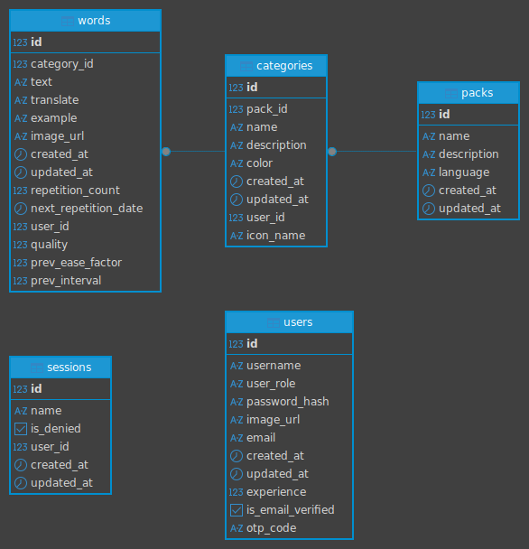

# Memowave Backend

Многофункциональный бэкенд для мобильного приложения Memowave, реализованный на Kotlin (Spring Boot) с использованием микросервисной архитектуры. Проект предназначен для управления карточками, учебными пакетами, пользователями, а также обеспечивает функции импорта/экспорта и взаимодействия с внешними сервисами.

## Архитектура и технологии

Проект построен по принципам микросервисной архитектуры и использует следующие ключевые технологии:

*   **Язык:** Kotlin
*   **Фреймворк:** [Spring Boot](https://spring.io/) - легковесный фреймворк для создания веб-приложений и микросервисов.
*   **Сборка:** Gradle Kotlin DSL (`build.gradle.kts`)
*   **Контейнеризация:** Docker и Docker Compose
*   **Оркестрация базы данных:** Liquibase для управления миграциями схемы базы данных.
*   **База данных:** PostgreSQL
*   **Хранилище файлов:** MinIO (S3-совместимое)
*   **Очереди сообщений:** RabbitMQ
*   **API Gateway:** Spring Boot Service, обеспечивающий агрегацию REST API и централизованную точку входа.
*   **Service Discovery:** Spring Boot Eureka для обнаружения и регистрации сервисов.
*   **Конфигурация:** Централизованный конфигурационный сервер.



## Модули (Микросервисы)

Проект состоит из нескольких независимых модулей, каждый из которых представляет собой микросервис:

1.  **`module-configuration`**
    *   **Назначение:** Централизованный сервер конфигураций. Предоставляет конфигурационные данные (например, URL, порты, настройки базы данных) другим сервисам во время их запуска.
    *   **Технология:** Spring Boot
    *   **Контейнер:** `eclipse-temurin:21-jre-alpine`

2.  **`module-discovery`**
    *   **Назначение:** Сервис обнаружения. Позволяет микросервисам регистрировать себя и находить друг друга по имени, обеспечивая динамическую маршрутизацию в распределенной системе.
    *   **Технология:** Spring Boot
    *   **Контейнер:** `eclipse-temurin:21-jre-alpine`

3.  **`module-user-management`**
    *   **Назначение:** Сервис управления пользователями. Обеспечивает функции регистрации, аутентификации, управления профилем и сессиями пользователей.
    *   **База данных:** PostgreSQL (таблицы `users`, `sessions`)
    *   **Интеграции:** Использует SMTP-сервер (fakesmtp) для отправки писем (подтверждение email и т.д.).
    *   **Технология:** Spring Boot
    *   **Контейнер:** `eclipse-temurin:21-jre-alpine`

4.  **`module-exercise`**
    *   **Назначение:** Сервис управления учебными упражнениями. Отвечает за создание, редактирование и выполнение карточек и обучающих пакетов (таблицы `packs`, `categories`, `words`).
    *   **База данных:** PostgreSQL
    *   **Интеграции:** Работает с MinIO для хранения медиафайлов (изображения, аудио) и с RabbitMQ для асинхронной обработки заданий.
    *   **Технология:** Spring Boot
    *   **Контейнер:** `eclipse-temurin:21-jre-alpine`

5.  **`module-import-export`**
    *   **Назначение:** Сервис для импорта и экспорта учебных пакетов. Обрабатывает загрузку файлов от пользователей и их выгрузку, обеспечивая взаимодействие между веб-интерфейсом и системой хранения.
    *   **Хранилище:** MinIO (бакеты `input-files`, `output-files`)
    *   **Очереди:** Использует RabbitMQ для асинхронной обработки задач импорта/экспорта.
    *   **Технология:** Ktor
    *   **Контейнер:** `eclipse-temurin:21-jre-alpine`

6.  **`module-web-ui`**
    *   **Назначение:** Веб-интерфейс для администрирования и, возможно, веб-версия приложения. Обрабатывает загрузку файлов от пользователей и отправляет их в очередь импорта.
    *   **Порт:** Доступен на хосте по порту `8084`.
    *   **Хранилище и Очереди:** Интегрирован с MinIO и RabbitMQ.
    *   **Технология:** Spring Boot
    *   **Контейнер:** `eclipse-temurin:21-jre-alpine`

7.  **`module-gateway`**
    *   **Назначение:** API Gateway. Является единым точкой входа для всех внешних обращений к бэкенду. Агрегирует API всех микросервисов и перенаправляет запросы к соответствующим сервисам.
    *   **Порт:** Доступен на хосте по порту `8080`.
    *   **Swagger UI:** Документация API доступна по адресу [http://localhost:8080/swagger-ui/index.html](http://localhost:8080/swagger-ui/index.html).
    *   **Технология:** Spring Boot
    *   **Контейнер:** `eclipse-temurin:21-jre-alpine`

8.  **`module-core`**
    *   **Назначение:** Общий модуль. Содержит общие библиотеки, классы моделей, утилиты и базовую функциональность, которые могут быть использованы другими микросервисами (например, общие сущности, DTO, вспомогательные функции).
    *   **Технология:** Kotlin
    *   **Зависимости:** Другие модули могут ссылаться на него в своих `build.gradle.kts`.

## Запуск проекта

Проект запускается с помощью Docker Compose:

1.  Убедитесь, что у вас установлены Docker и Docker Compose.
2.  Перейдите в корневую директорию проекта.
3.  Выполните команду:
    ```bash
    docker compose -f compose.yml -p memowave_backend up -d
    ```
    Эта команда соберет образы всех сервисов, запустит контейнеры, инициализирует базу данных с помощью Liquibase и запустит все микросервисы.

### Важные точки доступа

*   **API Gateway и Swagger UI:** [http://localhost:8080](http://localhost:8080)
*   **Веб-интерфейс (админка/веб-приложение):** [http://localhost:8084](http://localhost:8084)
*   **RabbitMQ Management Console:** `http://localhost:15672` (логин: `rbuser`, пароль: `rbuser`) - *необходимо раскомментировать порт в `compose.yml`*.
*   **MinIO Console:** `http://localhost:9001` (логин: `minioadmin`, пароль: `minioadmin`) - *необходимо раскомментировать порт в `compose.yml`*.
*   **MailCatcher (просмотр писем):** [http://localhost:1080](http://localhost:1080)

## Структура базы данных (Liquibase)

Миграции базы данных находятся в директории `liquibase/changelog/`. Они последовательно создают и изменяют схему:

*   Создание таблиц: `users`, `packs`, `categories`, `words`, `sessions`.
*   Наполнение начальными данными (например, корневой пользователь, пример учебного пакета).
*   Обновление структуры таблиц (добавление столбцов, изменение типов и т.д.).



## Дополнительные сервисы

*   **PostgreSQL:** Контейнер `memowave_postgres_container`, база данных `memowave_db`.
*   **Liquibase:** Автоматически применяет миграции при первом запуске.
*   **MinIO:** Временное хранилище для загружаемых и экспортируемых файлов.
*   **RabbitMQ:** Очереди сообщений для асинхронной обработки (импорт/экспорт, уведомления).
*   **fakesmtp:** Фейковый SMTP-сервер для перехвата и просмотра исходящих писем при разработке.
